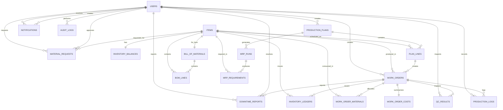

## Project Title
Web-Based Production Planning and Work Order System for Small Snack Food Manufacturing (MES)

## Subject
IT15/L Integrative Programming and Technologies

## Code
8491

## Time
7:30 - 9:30PM

## Topic
#14 Production & Manufacturing Execution System (MES) / Production Operations Management

## Products/Services
Small Snack Food Manufacturing Enterprise (chips, crackers, baked snacks)

## Website/Deployed Link
https://snackflowmes.onrender.com/

## API/ALGO/MODEL
N/A

## Security Features
- Authentication and authorization with role-based access for Admin, Planner, Operator, QC, and Manager
- Input validation for required fields and correct values
- Basic activity logs for work order updates, QC results, inventory changes, and other key actions
- Account protection through password rules and lockout handling
- reCAPTCHA support on login when enabled in configuration

## Target user/s
- Production Planner / Scheduler
- Operators (shop floor staff)
- Quality Control (QC) Inspector
- Manager / Owner
- System Admin

## Subs System / Management Transaction/Modules
1. User Login and Role Management
2. Items/Materials Master List
3. BOM (Bill of Materials) Management
4. Inventory (view + simple adjustment)
5. Production Planning and Scheduling
6. MRP (Material Requirements Planning) + shortage list
7. Work Order Management (create/release/start/complete)
8. Production Reporting (produced qty, scrap qty, time log)
9. Quality Control Check (pass/fail + notes)
10. Work Order Cost Summary (materials + labor + machine)
11. Material Request Management
12. Notification Management
13. Downtime Reporting
14. Reports and Analytics
15. System Settings

## Project Objectives
1. To create production plans and schedules for a small snack food manufacturing enterprise.
2. To compute required materials using MRP and identify material shortages.
3. To create and monitor work orders from release to completion.
4. To record production output, scrap, material usage, QC results, and downtime per work order.
5. To provide reports and cost summaries to support production monitoring and decision-making.

## Project Description
SnackFlow MES is a web-based production planning and work order system for a small snack food manufacturing enterprise. It supports users in creating production plans, computing required materials using MRP, creating and scheduling work orders, updating work order status, and recording production output, scrap, material usage, QC results, and downtime. It also provides reporting, cost summaries, material requests, notifications, and system settings for production monitoring and management. The system uses ASP.NET Core (C#), Entity Framework Core, MySQL, and role-based access for Admin, Planner, Operator, QC, and Manager.

## Type of Users / Role-Based Access
1. System Administrator (Admin)
Username: admin@snackflow.local
Password: Admin@1234!

2. Planner
Username: planner@snackflow.local
Password: Planner@1234!

3. Operator
Username: operator@snackflow.local
Password: Operator@1234!

4. QC
Username: qc@snackflow.local
Password: QcUser@1234!

5. Manager
Username: manager@snackflow.local
Password: Manager@1234!

## Use Case Diagram (Role-Based Access)
### Admin
- Login
- User Management
- Work Orders
- Material Request
- Downtime Reports
- Inventory Master
- Reports & Analytics
- System Settings

### Planner / Scheduler
- Login
- Production Planning
- Work Orders
- Bill of Materials
- Material Request
- Inventory
- Reports

### Operator
- Login
- My Work Orders
- Report Downtime

### Quality Control (QC) Inspector
- Login
- Quality Inspection
- Inspection History

### Manager / Owner
- Login
- Production Overview
- Downtime Reports
- Production Planning
- Inventory Status
- Reports & Analytics

## Data Dictionary
### SnackFlow MES

#### Users table
| Field Names | Datatype | Length | Description |
| --- | --- | --- | --- |
| UserId-PK | Text | 450 | User's ID number |
| FullName | Text | 100 | User's full name |
| UserName | Text | 256 | User's username or email |
| Email | Text | 256 | User's email address |
| PasswordHash | Text | 256 | Stored password hash |
| IsActive | Bool | 1 | Indicates whether the account can log in |
| TenantId | Text | 450 | Admin tenant ID linked to the user |
| CreatedAt | DateTime | 0 | Account creation date and time |

#### Items table
| Field Names | Datatype | Length | Description |
| --- | --- | --- | --- |
| ItemId-PK | Int | 9 | Item ID number |
| ItemCode | Text | 30 | Item code |
| ItemName | Text | 150 | Item name |
| ItemType | Text | 20 | Item type (RawMaterial, Packaging, FinishedGood, SemiFinished) |
| UnitOfMeasure | Text | 15 | Item unit of measure |
| Category | Text | 80 | Item category |
| UnitCost | Decimal | 12,4 | Standard item cost |
| ReorderPoint | Decimal | 12,4 | Minimum stock level |
| Description | Text | 300 | Item description |
| IsActive | Bool | 1 | Indicates whether the item is active |
| IsArchived | Bool | 1 | Indicates whether the item is archived |
| TenantId | Text | 450 | Admin tenant ID linked to the item |

#### Bill of Materials table
| Field Names | Datatype | Length | Description |
| --- | --- | --- | --- |
| BomId-PK | Int | 9 | BOM ID number |
| ItemId-FK | Int | 9 | Finished good item ID |
| Version | Text | 10 | BOM version |
| BatchOutputQty | Decimal | 12,4 | Standard output quantity per batch |
| BatchOutputUom | Text | 15 | Output unit of measure |
| EstMachineHours | Decimal | 8,2 | Estimated machine hours per batch |
| EstLaborHours | Decimal | 8,2 | Estimated labor hours per batch |
| IsActive | Bool | 1 | Indicates whether the BOM is active |
| Notes | Text | 500 | BOM notes |
| TenantId | Text | 450 | Admin tenant ID linked to the BOM |

#### BOM Lines table
| Field Names | Datatype | Length | Description |
| --- | --- | --- | --- |
| BomLineId-PK | Int | 9 | BOM line ID number |
| BomId-FK | Int | 9 | BOM header ID |
| ItemId-FK | Int | 9 | Material item ID |
| QtyPerBatch | Decimal | 12,4 | Quantity required per batch |
| UnitOfMeasure | Text | 15 | Unit of measure |
| ScrapFactor | Decimal | 8,2 | Scrap allowance factor |
| Notes | Text | 300 | BOM line notes |

#### Inventory Balance table
| Field Names | Datatype | Length | Description |
| --- | --- | --- | --- |
| BalanceId-PK | Int | 9 | Inventory balance ID number |
| ItemId-FK | Int | 9 | Item ID |
| QtyOnHand | Decimal | 12,4 | Current stock on hand |
| QtyReserved | Decimal | 12,4 | Reserved stock quantity |
| LastUpdated | DateTime | 0 | Last stock update date and time |
| TenantId | Text | 450 | Admin tenant ID linked to the balance |

#### Inventory Ledger table
| Field Names | Datatype | Length | Description |
| --- | --- | --- | --- |
| LedgerId-PK | Int | 9 | Inventory ledger ID number |
| ItemId-FK | Int | 9 | Item ID |
| MovementType | Text | 25 | Stock movement type |
| Qty | Decimal | 12,4 | Signed quantity movement |
| UnitOfMeasure | Text | 15 | Unit of measure |
| BalanceAfter | Decimal | 12,4 | Stock balance after the movement |
| WorkOrderId-FK | Int | 9 | Related work order ID |
| Reference | Text | 100 | Reference number or note |
| Notes | Text | 300 | Movement notes |
| PostedByUserId-FK | Text | 450 | User who posted the movement |
| PostedAt | DateTime | 0 | Posting date and time |
| TenantId | Text | 450 | Admin tenant ID linked to the ledger |

#### Production Plan table
| Field Names | Datatype | Length | Description |
| --- | --- | --- | --- |
| PlanId-PK | Int | 9 | Production plan ID number |
| PlanName | Text | 100 | Production plan name |
| PlanDateFrom | DateTime | 0 | Start date of the plan |
| PlanDateTo | DateTime | 0 | End date of the plan |
| Status | Text | 20 | Plan status |
| Notes | Text | 500 | Plan notes |
| CreatedByUserId-FK | Text | 450 | User who created the plan |
| TenantId | Text | 450 | Admin tenant ID linked to the plan |

#### Plan Lines table
| Field Names | Datatype | Length | Description |
| --- | --- | --- | --- |
| PlanLineId-PK | Int | 9 | Plan line ID number |
| PlanId-FK | Int | 9 | Production plan ID |
| ItemId-FK | Int | 9 | Item ID to be produced |
| PlannedQty | Decimal | 12,4 | Planned production quantity |
| UnitOfMeasure | Text | 15 | Unit of measure |
| ScheduledDate | DateTime | 0 | Scheduled production date |
| ProductionLine | Text | 80 | Assigned production line |
| Status | Text | 20 | Plan line status |
| Notes | Text | 300 | Plan line notes |

#### MRP Run table
| Field Names | Datatype | Length | Description |
| --- | --- | --- | --- |
| MrpRunId-PK | Int | 9 | MRP run ID number |
| PlanId-FK | Int | 9 | Production plan ID |
| RunAt | DateTime | 0 | Date and time the MRP was run |
| RunByUserId-FK | Text | 450 | User who ran the MRP |
| Status | Text | 15 | MRP run status |
| Notes | Text | 300 | MRP run notes |
| TenantId | Text | 450 | Admin tenant ID linked to the MRP run |

#### MRP Requirements table
| Field Names | Datatype | Length | Description |
| --- | --- | --- | --- |
| MrpReqId-PK | Int | 9 | MRP requirement ID number |
| MrpRunId-FK | Int | 9 | MRP run ID |
| ItemId-FK | Int | 9 | Required item ID |
| GrossRequirement | Decimal | 12,4 | Total material requirement |
| StockOnHand | Decimal | 12,4 | Current stock on hand |
| NetRequirement | Decimal | 12,4 | Shortage quantity |
| IsShortage | Bool | 1 | Indicates whether the item is short |

#### Work Orders table
| Field Names | Datatype | Length | Description |
| --- | --- | --- | --- |
| WorkOrderId-PK | Int | 9 | Work order ID number |
| WoNumber | Text | 30 | Work order number |
| ItemId-FK | Int | 9 | Item to be produced |
| BomId-FK | Int | 9 | BOM used for the work order |
| PlanLineId-FK | Int | 9 | Related plan line ID |
| PlannedQty | Decimal | 12,4 | Planned work order quantity |
| ActualQty | Decimal | 12,4 | Actual produced quantity |
| UnitOfMeasure | Text | 15 | Unit of measure |
| Status | Text | 20 | Work order status |
| ProductionLine | Text | 80 | Assigned production line |
| ScheduledStart | DateTime | 0 | Scheduled start date and time |
| ScheduledEnd | DateTime | 0 | Scheduled end date and time |
| ActualStart | DateTime | 0 | Actual start date and time |
| ActualEnd | DateTime | 0 | Actual end date and time |
| Notes | Text | 500 | Work order notes |
| CreatedByUserId-FK | Text | 450 | User who created the work order |
| TenantId | Text | 450 | Admin tenant ID linked to the work order |

#### Work Order Materials table
| Field Names | Datatype | Length | Description |
| --- | --- | --- | --- |
| WoMaterialId-PK | Int | 9 | Work order material ID number |
| WorkOrderId-FK | Int | 9 | Work order ID |
| ItemId-FK | Int | 9 | Material item ID |
| PlannedQty | Decimal | 12,4 | Planned material quantity |
| ActualQty | Decimal | 12,4 | Actual material quantity used |
| UnitOfMeasure | Text | 15 | Unit of measure |
| UnitCostSnapshot | Decimal | 12,4 | Unit cost at work order release |

#### Production Logs table
| Field Names | Datatype | Length | Description |
| --- | --- | --- | --- |
| LogId-PK | Int | 9 | Production log ID number |
| WorkOrderId-FK | Int | 9 | Work order ID |
| LogDate | DateTime | 0 | Production log date |
| Shift | Text | 15 | Shift name |
| ProducedQty | Decimal | 12,4 | Produced quantity |
| ScrapQty | Decimal | 12,4 | Scrap quantity |
| UnitOfMeasure | Text | 15 | Unit of measure |
| LaborHours | Decimal | 8,2 | Labor hours used |
| MachineHours | Decimal | 8,2 | Machine hours used |
| Notes | Text | 500 | Production log notes |
| RecordedByUserId-FK | Text | 450 | User who recorded the log |
| TenantId | Text | 450 | Admin tenant ID linked to the log |

#### QC Results table
| Field Names | Datatype | Length | Description |
| --- | --- | --- | --- |
| QcResultId-PK | Int | 9 | QC result ID number |
| WorkOrderId-FK | Int | 9 | Work order ID |
| InspectedAt | DateTime | 0 | Inspection date and time |
| Result | Text | 20 | QC result |
| CheckType | Text | 50 | Type of quality check |
| SampleQty | Decimal | 12,4 | Sample quantity inspected |
| DefectQty | Decimal | 12,4 | Defective quantity found |
| Notes | Text | 1000 | QC notes |
| Disposition | Text | 20 | QC disposition |
| InspectedByUserId-FK | Text | 450 | QC inspector user ID |
| TenantId | Text | 450 | Admin tenant ID linked to the QC result |

#### Work Order Cost table
| Field Names | Datatype | Length | Description |
| --- | --- | --- | --- |
| CostId-PK | Int | 9 | Work order cost ID number |
| WorkOrderId-FK | Int | 9 | Work order ID |
| MaterialCost | Decimal | 14,2 | Material cost total |
| LaborCost | Decimal | 14,2 | Labor cost total |
| MachineCost | Decimal | 14,2 | Machine cost total |
| OtherCost | Decimal | 14,2 | Other cost total |
| CostPerUnit | Decimal | 14,4 | Cost per unit produced |
| LaborRatePerHour | Decimal | 10,2 | Labor rate per hour |
| MachineRatePerHour | Decimal | 10,2 | Machine rate per hour |
| Notes | Text | 300 | Cost summary notes |
| ComputedAt | DateTime | 0 | Cost computation date and time |
| ComputedByUserId-FK | Text | 450 | User who computed the cost |

#### Material Requests table
| Field Names | Datatype | Length | Description |
| --- | --- | --- | --- |
| RequestId-PK | Int | 9 | Material request ID number |
| ItemId-FK | Int | 9 | Requested item ID |
| RequestedQty | Decimal | 12,4 | Requested quantity |
| UnitOfMeasure | Text | 15 | Unit of measure |
| Reason | Text | 50 | Reason for request |
| Status | Text | 20 | Request status |
| Priority | Text | 20 | Request priority |
| RequiredByDate | DateTime | 0 | Needed-by date |
| Notes | Text | 1000 | Request notes |
| RequestedByUserId-FK | Text | 450 | User who made the request |
| RequestedAt | DateTime | 0 | Request date and time |
| ApprovedByUserId-FK | Text | 450 | User who approved or rejected the request |
| ApprovedAt | DateTime | 0 | Approval date and time |
| ApprovalNotes | Text | 1000 | Approval or rejection notes |
| FulfilledAt | DateTime | 0 | Fulfillment date and time |
| FulfilledQty | Decimal | 12,4 | Quantity fulfilled |
| TenantId | Text | 450 | Admin tenant ID linked to the request |

#### Notifications table
| Field Names | Datatype | Length | Description |
| --- | --- | --- | --- |
| NotificationId-PK | Int | 9 | Notification ID number |
| RecipientUserId-FK | Text | 450 | Target user ID |
| RecipientRole | Text | 50 | Target role |
| Type | Text | 50 | Notification type |
| Title | Text | 200 | Notification title |
| Message | Text | 1000 | Notification message |
| RelatedEntityType | Text | 50 | Related entity type |
| RelatedEntityId | Int | 9 | Related entity ID |
| ActionUrl | Text | 500 | Link to open the related page |
| IsRead | Bool | 1 | Read status |
| CreatedAt | DateTime | 0 | Notification creation date and time |
| ReadAt | DateTime | 0 | Notification read date and time |
| Priority | Text | 20 | Notification priority |
| CreatedByUserId-FK | Text | 450 | User who created the notification |
| TenantId | Text | 450 | Admin tenant ID linked to the notification |

#### Downtime Reports table
| Field Names | Datatype | Length | Description |
| --- | --- | --- | --- |
| DowntimeId-PK | Int | 9 | Downtime report ID number |
| WorkOrderId-FK | Int | 9 | Work order ID |
| ProductionLine | Text | 100 | Production line affected |
| StartTime | DateTime | 0 | Downtime start date and time |
| EndTime | DateTime | 0 | Downtime end date and time |
| DurationMinutes | Int | 9 | Downtime duration in minutes |
| Reason | Text | 50 | Downtime reason |
| Description | Text | 500 | Downtime description |
| ReportedByUserId-FK | Text | 450 | User who reported the downtime |
| ReportedAt | DateTime | 0 | Report date and time |
| Status | Text | 20 | Downtime status |
| Resolution | Text | 500 | Resolution details |
| ResolvedByUserId-FK | Text | 450 | User who resolved the downtime |
| ResolvedAt | DateTime | 0 | Resolution date and time |
| OrganizationId | Text | 100 | Organization or tenant reference |

#### Audit Logs table
| Field Names | Datatype | Length | Description |
| --- | --- | --- | --- |
| AuditLogId-PK | Int | 9 | Audit log ID number |
| UserId-FK | Text | 450 | Related user ID |
| UserName | Text | 100 | Related username |
| Module | Text | 40 | Module affected |
| Action | Text | 30 | Action performed |
| EntityId | Int | 9 | Related record ID |
| Description | Text | 500 | Description of the action |
| OldValues | Text | 0 | Previous values |
| NewValues | Text | 0 | New values |
| IpAddress | Text | 45 | IP address |
| Timestamp | DateTime | 0 | Action date and time |
| TenantId | Text | 450 | Admin tenant ID linked to the audit log |

## Entity Relational Diagram (ERD)

### ERD Summary
- One user can create many production plans, work orders, logs, QC results, material requests, notifications, downtime reports, and audit logs.
- One item can be linked to BOMs, BOM lines, inventory balances, inventory ledger entries, plan lines, work order materials, MRP requirements, and material requests.
- One production plan contains many plan lines and can generate many MRP runs.
- One plan line can generate many work orders.
- One MRP run produces many MRP requirement lines.
- One work order can have many work order material rows, production logs, QC results, inventory ledger entries, and downtime reports.
- One work order has one cost summary.
- One BOM has many BOM lines.
- Notifications can be sent to a specific user or to a role.
